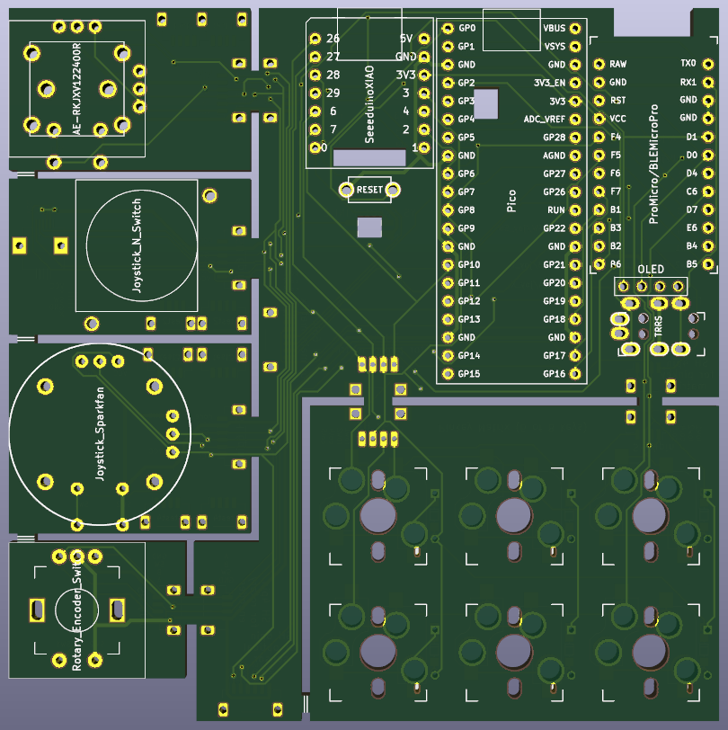
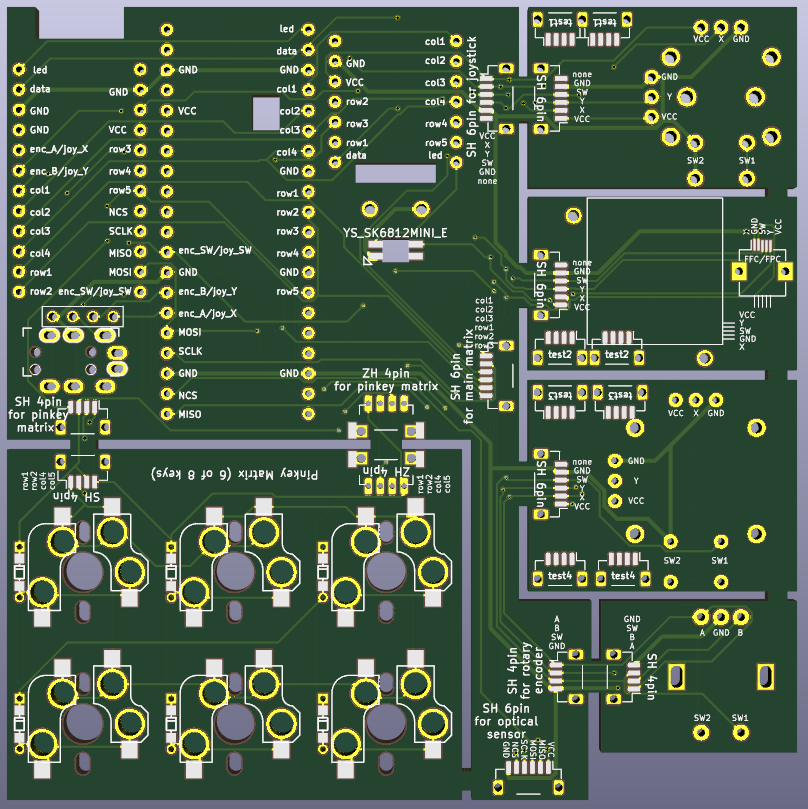

# Galapagos Protoboard

## Important point

All functions have not yet been verified on an actual device.

The microcontroller is one of the following: Pro Micro, Raspberry Pi Pico, or Xiao RP2040.

The key matrix is using duplex matrix.

You can use a rotary encoder or a joystick.

The joystick is one of the following:  ALPS RKJXV122400R, Nintendo Switch Joystick for Joy-Cons,  or Sparkfan joystick.

You may be able to use a trackball.

## Pin assign

### Key switch

|                         | Pro Micro | Raspberry Pi Pico | Xiao RP2040 |
| ----------------------- | --------- | ----------------- | ----------- |
| Upper left key switch   | F5 to D4  | GP9 to GP2        | GP6 to GP26 |
| Lower left key switch   | F5 to C6  | GP9 to GP3        | GP6 to GP27 |
| Upper middle key switch | D4 to F6  | GP2 to GP10       | GP26 to GP7 |
| Lower middle key switch | C6 to F6  | GP3 to GP10       | GP27 to GP7 |
| Upper right key switch  | D4 to F5  | GP2 to GP9        | GP26 to GP6 |
| Lower right key switch  | C6 to F5  | GP3 to GP9        | GP27 to GP6 |

### Rotary Encoder

|             | Pro Micro | Raspberry Pi Pico | Xiao RP2040 |
| ----------- | --------- | ----------------- | ----------- |
| A           | D1        | GP20              | No assign   |
| B           | D0        | GP21              | No assign   |
| Push switch | B6        | GP22              | No assign   |

### Joystick

|             | Pro Micro | Raspberry Pi Pico | Xiao RP2040 |
| ----------- | --------- | ----------------- | ----------- |
| Horizontal  | D1        | GP20              | No assign   |
| Vertical    | D0        | GP21              | No assign   |
| Push switch | B6        | GP22              | No assign   |

### Trackball

|             | Pro Micro | Raspberry Pi Pico | Xiao RP2040 |
| ----------- | --------- | ----------------- | ----------- |
| MISO        | B3        | GP16              | No assign   |
| MOSI        | B2        | GP19              | No assign   |
| SCLK        | B1        | GP18              | No assign   |
| NCS         | F7        | GP17              | No assign   |

